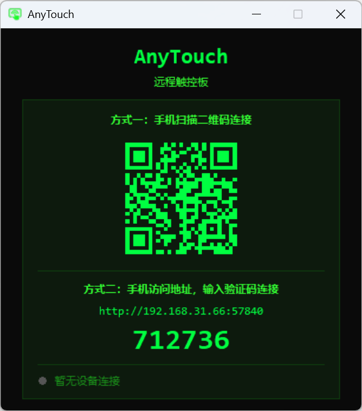

# AnyTouch - 远程触控板

把手机变成电脑的无线触控板。手机浏览器打开网页即可控制电脑鼠标，无需安装任何 App。



## 功能

- **单指滑动** — 移动鼠标光标
- **单指轻点** — 左键单击
- **双击轻点** — 双击
- **双击按住** — 进入 press down（拖动模式），松手释放
- **双击按住并滑动** — 立即拖动
- **长按 500ms** — 进入 press down（拖动模式）
- **双指轻点** — 右键单击
- **双指上下滑动** — 垂直滚动
- **双指左右滑动** — 水平滚动
- **快速双指拉动** — 滚动加速
- **左键 / 右键按钮** — 物理鼠标式 press down / press up，按住可滑动拖拽
- **滚动防误触** — 双指滚动期间屏蔽鼠标移动和按键
- **夜间模式** — 右上角切换，自动记忆
- **设备状态** — 显示在线/离线状态和连接状态，支持主动断开/重连
- **单设备限制** — 只允许一个设备连接，其他设备会收到提示
- **扫码连接** — 启动后终端显示二维码
- **WebSocket 通信** — 低延迟实时控制

## 环境要求

- Windows 系统
- Python 3.8+
- 手机和电脑在同一局域网

## 安装

```bash
pip install websockets qrcode pywin32
```

## 使用

```bash
python anytouch.py
```

启动后终端会显示二维码和访问地址，手机扫码或浏览器输入地址即可使用。

端口随机分配，每次启动会自动选择可用端口。

## 手势说明

| 手势 | 操作 |
|------|------|
| 单指滑动 | 移动光标 |
| 单指轻点 | 左键单击 |
| 快速双击 | 双击 |
| 双击按住 | press down（拖动） |
| 长按不动 | press down（拖动） |
| 双指轻点 | 右键单击 |
| 双指上下滑 | 垂直滚动 |
| 双指左右滑 | 水平滚动 |

## 打包

使用 PyInstaller 打包为单文件 exe：

```bash
pip install pyinstaller

pyinstaller --noconfirm --onefile --windowed --name AnyTouch --icon=AnyTouch.ico --add-data "AnyTouch.ico;." --hidden-import websockets --hidden-import qrcode --hidden-import PIL --hidden-import pystray --hidden-import win32clipboard gui.py
```

打包完成后在 `dist/AnyTouch.exe` 即可找到可执行文件。

## 许可证

MIT
